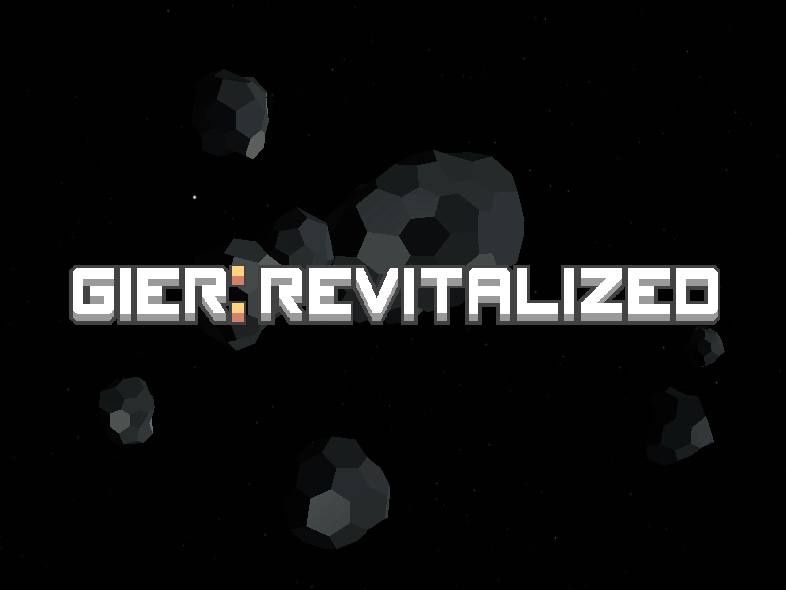
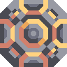

# Gier Revitalized
 

> This mod might be incompatible with other mods
 

### Gier Revitalized is intended to bring back this asteroid sector, but within my concept. 

**Such as:**

- Being Endless
- Randomly Generated
- And also including many modded blocks
- Also has IOS support for some reason
- Or play on kela with pre-made challange maps

## Though expect: 

- Unfair Generation (Bound to happen)
- Constant Updating (This mod updates frequently but most are small)

 
 

 
 

  
  
  
  

[Icon]: icon.png
[gp1]: gameplay-1.png
[gp2]: gameplay-2.png
